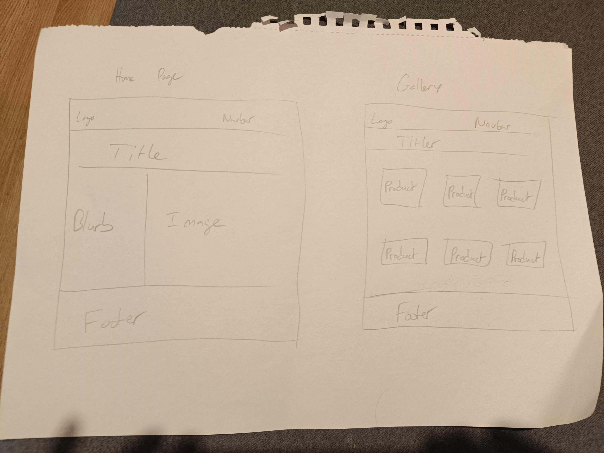
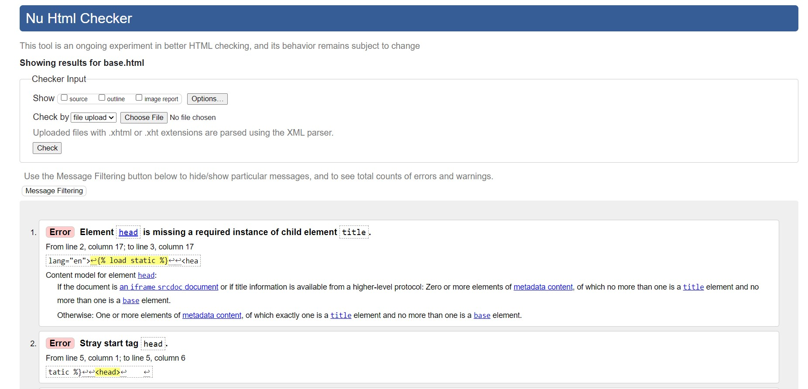
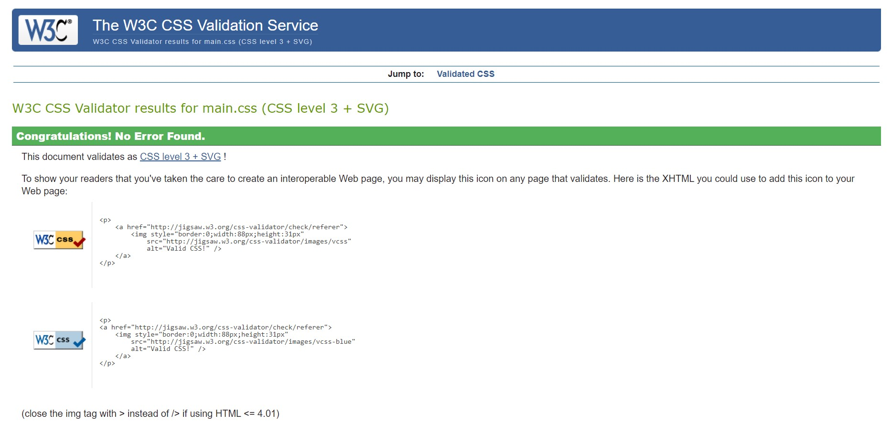
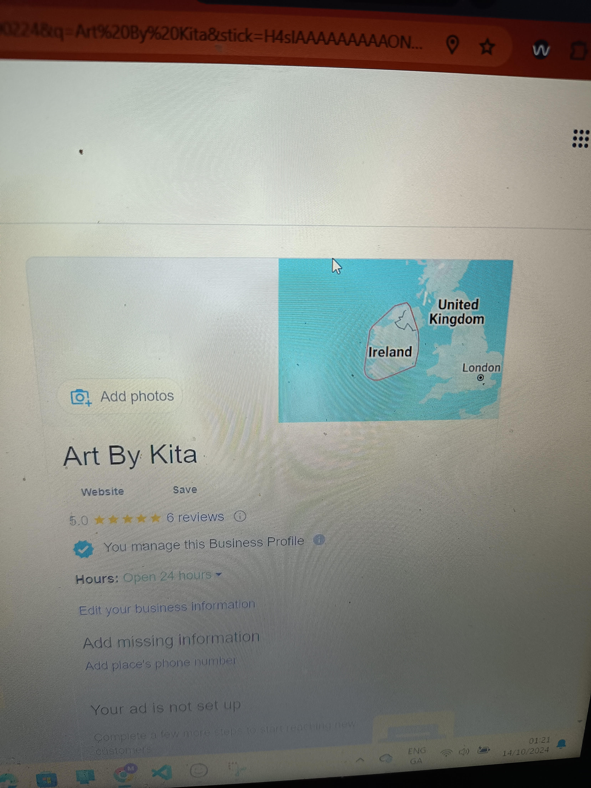

# Art By Kita

[View the live project here.](https://art-by-kita-ci-af8ba42cd883.herokuapp.com/)

Art By Kita is an e-commerce website designed for the sale of unique and custom landscape and dreamscape paintings. These are painted with acrylic paint on canvas and are aimed at any customers who appreciate fine art and landscapes.

---

## Business Model Overview
Art By Kita is an online art store specializing in **original paintings** and **custom commissions**. The business operates as a **B2C (Business to Consumer)** model, offering **one-of-a-kind artworks** directly to buyers.

Customers can purchase existing paintings or request personalised commissions based on their ideas, photos, or specific themes. The platform ensures a seamless shopping experience with **secure payment processing and global shipping**.

---

## Target Audience
Our customers include:
- **Art Collectors** – Individuals looking for unique, high-quality paintings.
- **Interior Designers** – Professionals sourcing exclusive artwork for clients.
- **Gift Buyers** – People seeking personalised and meaningful gifts.
- **Fans of the Artist’s Work** – Supporters who follow the artist’s journey and wish to own a piece.

---

## Revenue Streams
Art By Kita generates revenue through:
1. **Direct Sales** – Customers purchase original paintings from the online store.
2. **Custom Commissions** – Buyers can request bespoke artwork tailored to their vision.

---

## Value Proposition
### What Makes Us Stand Out?
✅ **Exclusive Artworks** – Every painting is unique and handcrafted.  
✅ **High-Quality Materials** – Premium acrylic on pressed canvas for long-lasting beauty.  
✅ **Personalized Commissions** – Custom paintings based on client requests.  
✅ **Global Shipping with Free Delivery** – No extra shipping costs for customers.  
✅ **Secure & Easy Checkout** – Payments processed through **Stripe**.  

---

## User Experience (UX)

### User Stories

#### Customer Goals

1. As a Customer, I want to easily navigate the site and find the right painting for me.
2. As a Customer, I want to be able to easily order products and make my payments online.
3. As a Customer, I want to be able to contact the admin staff if I have any questions about specific paintings, including custom ideas I have.

#### Staff Goals

1. As Staff, I want to easily add and remove stock.
2. As Staff, I want to be able to update listings on the site, including stock availability.
3. As Staff, I want to have the ability to easily reply to customer messages.

### Design

#### Colour Scheme
The main colours used are pink, white, and black.

#### Typography
The Roboto font is used as the main font throughout the website for all paragraphs and links, and the Alex Brush font is used for headings.

#### Imagery
Imagery is important. All images included in the website were painted by my partner, Kita, for whom this website was created.

#### Wireframes

---

## Features

- Fully responsive across all device sizes.
- Interactive elements.
- Secure Stripe payment integration.

---

## Technologies Used

- **Languages & Frameworks**: HTML, CSS, Django, Bootstrap, JavaScript, jQuery
- **Version Control**: Git & GitHub
- **Project Management**: Kanban
- **Media & Hosting**: Canva, Cloudinary
- **Payments & SEO**: Stripe, Google Search Console

---

## Testing

- **W3C HTML Validator** – No errors except for Django-specific code.  
  

  The validator flags obsolete attributes (`frameborder`, `allowtransparency`, and `scrolling`) and a private browsing context name (`__privateStripeMetricsControllerXXXX`) in iframes generated by Stripe. These are beyond my control as they are part of Stripe’s integration. My code itself adheres to modern standards and passes validation without third-party scripts.

  Also, the bottom warning about H1 elements is unnecessary, as it is the top-level H1 and the only H1 element used on any page.

- **Jigsaw CSS Validator** – No errors.  
  

- **JSHint** – No errors in JavaScript code.  
  

- **CI Python Linter (PEP8)** – No major errors.  
  

### Further Testing

- The Website was tested on Google Chrome, Internet Explorer, Microsoft Edge, and Safari browsers.  
- The website was viewed on various devices, including large screen televisions, desktops, laptops, tablets, and different Android and Apple smartphones. It displayed correctly on all tested devices.  
- Extensive testing was conducted to ensure all pages linked correctly, forms submitted properly, and items added to the basket were saved correctly.  
- Friends and family members reviewed the site and documentation to point out any bugs and/or user experience issues.  
- Payment functionality was tested in Stripe's test environment.  
- Multiple messages were sent, received, and deleted to confirm messaging functionality.  

---

## Marketing

- Used Meta tags and in-content SEO keywords to improve searchability.
- Created a Facebook business profile.  
  
- Created a Google Business Profile.  
  
- Created sitemaps and robots.txt.
- Submitted sitemaps to Google Search Console.
- Deployed an active version of the website under the domain [www.artbykita.com](https://www.artbykita.com).

---

## Deployment

### GitHub Pages

The project was deployed to GitHub Pages using the following steps:

1. Log in to GitHub and locate the [GitHub Repository](https://github.com/).
2. At the top of the Repository (not the top of the page), locate the **Settings** button in the menu.
3. Scroll down the Settings page until you locate the **GitHub Pages** section.
4. Under **Source**, click the dropdown called "None" and select **Master Branch**.
5. The page will automatically refresh.
6. Scroll back down through the page to locate the now published site [link](https://github.com/) in the **GitHub Pages** section.

### Deploying on Heroku

The deployment of the project was done using [Heroku](https://www.heroku.com/) through the following steps:

1. Log in to Heroku.
2. Click the **New** button from the dashboard and select **Create new app**.
3. Enter a unique name for the application and select the appropriate region.
4. Click **Create app**.
5. Navigate to the **Config Vars** section in the settings tab and click **Reveal config vars**.
6. Add a config var:
   - In the **KEY** field, enter `CREDS`.
   - In the **VALUE** field, copy and paste the contents of your `creds.json` file and click **Add**.
7. Add another config var:
   - In the **KEY** field, enter `PORT`.
   - In the **VALUE** field, enter `8000` and click **Add**.
8. Scroll to the **Buildpacks** section and click **Add buildpack**.
9. Select **Python** and save changes.
10. Add another buildpack, select **Node.js**, and save changes again.
11. Ensure that the Python buildpack is above the Node.js buildpack.
12. Navigate to the **Deploy** section.
13. Select **GitHub** as the deployment method and click **Connect to GitHub**.
14. Search for the GitHub repository name in the search bar.
15. Click on **Connect** to link the repository to Heroku.
16. Scroll down and click on **Deploy Branch**.
17. Once the app is deployed, Heroku will notify you and provide a button to view the app.

---

## Credits

### Content

The content for this website was developed by myself and my partner, as this website is dedicated to her and her artwork.

### Media

All images used on the site were provided by my partner, as she painted them all.

### Code

All code in this website is my own to the best of my knowledge.

## Thanks

I would like to give recognition to my fantastic mentor Lauren-Nicole Popich for her help with and guidance on this project, and to my life partner Nikita Ellison for keeping me grounded, advising me to step away when needed and ensuring I took care of myself as I got lost in the code.
